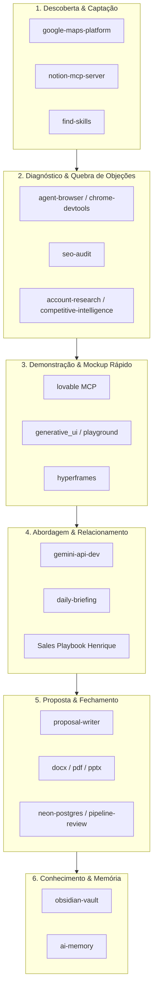

# Agent Skills e Capacidades do Sistema

> Guia oficial e completo de todos os Agent Skills e servidores MCP disponíveis no ambiente do Henrique para transformar o **Prospector CRM** em uma máquina de captação, diagnóstico, demonstração e fechamento de clientes locais.

---

## 1. Mapeamento de Skills no Ciclo de Vida do Cliente



---

## 2. Detalhamento e Como Utilizar Cada Skill

### 🚀 1. Geração de Demonstrações e Mockups Rápidos

#### `lovable` (Servidor MCP Ativo)
- **O que faz:** Cria, edita e publica projetos frontend inteiros na nuvem de forma automatizada.
- **Como Henrique pode usar:**
  > *"Crie uma landing page moderna para a Marmitaria Silva Jardim com seções de cardápio do dia, depoimentos de clientes locais e botão flutuante de pedidos no WhatsApp."*
- **Efeito comercial:** Em vez de prometer que vai fazer, você já manda o link provisório funcionando no WhatsApp do cliente. Isso gera encanto imediato e diferencia Henrique de 99% da concorrência.

#### `generative_ui` & `playground` & `web-artifacts-builder`
- **O que faz:** Renderiza interfaces completas, protótipos em React e dashboards interativos na hora.
- **Como usar:** Para criar mockups visuais e telas interativas antes de programar o código final ou para mostrar em videoconferência/reunião presencial.

#### `hyperframes` & `hyperframes-cli`
- **O que faz:** Renderiza vídeos promocionais e motion graphics a partir de código HTML.
- **Como usar:** Gerar um mini-vídeo de 10 a 15 segundos apresentando a nova identidade do site do cliente para enviar pelo WhatsApp ou Instagram.

---

### 🔍 2. Diagnóstico Técnico e Quebra de Objeções

#### `seo-audit` (Instalado via `skills.sh`)
- **O que faz:** Auditoria completa de SEO on-page, meta tags, títulos, schema.org e indexação no Google.
- **Como usar:**
  > *"Rode um seo-audit no site do concorrente X e no site do lead Y para comparar a presença dos dois nas buscas de Santos."*
- **Argumento de venda:** Prova técnica irrefutável de por que o cliente não está aparecendo nas primeiras posições de busca da cidade.

#### `agent-browser` & `chrome-devtools` & `debug-optimize-lcp`
- **O que faz:** Abre navegadores reais em segundo plano, tira capturas de tela e audita performance (Largest Contentful Paint, Core Web Vitals).
- **Como usar:**
  > *"Abra o site atual da Auto Elétrica Mathias, tire um screenshot mobile e meça a velocidade de carregamento no 4G."*
- **Argumento de venda:** *"O site atual de vocês demora 7 segundos para carregar no celular; cada segundo de atraso faz você perder 20% das pessoas que clicam."*

#### `account-research` & `competitive-intelligence`
- **O que faz:** Mapeia sócios, faturamento estimado, histórico da empresa e concorrentes diretos no mesmo bairro.
- **Como usar:** Identificar os pontos fracos dos concorrentes locais para propor diferenciais únicos no novo site.

---

### 💼 3. Fechamento, Propostas e Contratos

#### `proposal-writer` (Instalado via `skills.sh`)
- **O que faz:** Estruturação de propostas comerciais de alto impacto (dor do cliente, escopo da solução, cronograma, investimento e retorno esperado).
- **Como usar:**
  > *"Crie uma proposta comercial sob medida para a Oficina Lucas Fortunato focada em site institucional + botão de agendamento no WhatsApp + manutenção mensal."*

#### `pdf` e `docx`
- **O que faz:** Geração automatizada de documentos Word e PDFs profissionais com formatação, tabelas de preço, termos e campos de assinatura.
- **Como usar:**
  > *"Gere a proposta da Oficina Lucas Fortunato em PDF profissional com o logotipo do Henrique, tabela de parcelamento e dados de contato para envio no WhatsApp."*

#### `pptx`
- **O que faz:** Cria apresentações de slides (.pptx) para reuniões com empresas de maior porte ou clínicas médicas.

#### `xlsx`
- **O que faz:** Planilhas financeiras de controle de mensalidades de suporte e hospedagem de clientes fechados.

---

### ⚡ 4. Rotina Diária e Inteligência Comercial

#### `daily-briefing`
- **O que faz:** Organiza as tarefas comerciais matinais priorizadas por impacto.
- **Como usar:**
  > *"Gere meu daily briefing para hoje com os leads em estágio de acompanhamento e os 5 contatos prioritários para disparar abordagem."*

#### `pipeline-review` & `build-dashboard`
- **O que faz:** Avalia a saúde do funil do CRM, identifica leads esquecidos há mais de 7 dias e gera gráficos interativos.

#### `gemini-api-dev` & `gemini-interactions-api`
- **O que faz:** Motor de inteligência que analisa os dados da empresa, pontua o lead (score 0-100) e escreve as 3 variações de mensagens comerciais personalizadas.

---

### 🧠 5. Memória e Expansão Contínua de Skills

#### `find-skills` (Instalado)
- **O que faz:** Gerenciador do ecossistema de skills (`npx skills`). Permite pesquisar e instalar novas automações globais com um comando:
  ```bash
  # Buscar qualquer habilidade nova
  npx skills find [termo]

  # Instalar skill globalmente
  npx skills add <owner/repo@skill> -g -y
  ```

#### `obsidian-vault` & `ai-memory`
- **O que faz:**
  - `obsidian-vault`: Mantém o conhecimento legível por humanos na pasta `Second Brain/` com wikilinks.
  - `ai-memory`: Servidor MCP nativo de memória persistente de longo prazo em disco (SQLite + FTS5 + vetor). Configurado para o projeto `prospector-crm` (`workspace: "default"`), permitindo consultas rápidas (`memory_query`), registro de regras duradouras (`memory_write_page`) e resumos estruturados (`memory_briefing`).

---

## 3. Playbooks Operacionais Dedicados

Para aprender a usar cada conjunto na prática diária, consulte as notas dedicadas:
1. [[Playbook - Demonstracoes e Mockups com Lovable]]
2. [[Playbook - Auditoria de Sites e Quebra de Objeções]]
3. [[Playbook - Propostas Comerciais e Fechamento]]
4. [[Playbook - Rotina Diaria e Find Skills]]

---

Relacionadas: [[Prospector CRM Index]] · [[Sales Playbook]] · [[Product Vision]] · [[Roadmap]]
