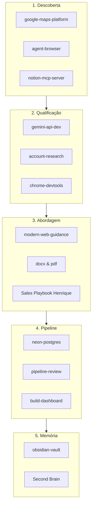

# Agent Skills e Capacidades do Sistema

> Guia detalhado de todos os Agent Skills e servidores MCP disponíveis no ambiente de desenvolvimento do Henrique para impulsionar o **Prospector CRM**, da prospecção à entrega do projeto.

---

## 1. Mapeamento de Skills e Aplicações no CRM

---

## 2. Detalhamento por Etapa Operacional

### A. Prospecção e Captação de Empresas

#### `google-maps-platform`
- **O que faz:** Integração direta com Google Places API, Geocoding, Nearby Search e Detalhes de Locais.
- **Como usar no CRM:**
  - Resolução automática de links curtos do Google Maps (`maps.app.goo.gl` / `/maps/place/`).
  - Busca em massa de estabelecimentos locais por segmento (ex: "Oficinas Mecânicas em Santos", "Restaurantes em São Vicente").
  - Extração de telefone verificado, endereço completo, status de funcionamento e website oficial.

#### `notion-mcp-server`
- **O que faz:** Leitura, busca e sincronização de bancos de dados e páginas no Notion.
- **Como usar no CRM:**
  - Importação de leads anotados no Notion direto para o funil do Prospector CRM.
  - Sincronização bidirecional de notas de reuniões e follow-ups entre o CRM e o workspace do Notion.

#### `agent-browser` & `chrome-devtools`
- **O que faz:** Automação programática e inspeção via navegador Headless / Chromium.
- **Como usar no CRM:**
  - Checar se o site de um lead realmente está no ar ou se é uma página quebrada/desatualizada.
  - Tirar prints automáticos do site do cliente para montar demonstrações visuais do tipo "Antes vs Depois".
  - Auditar velocidade de carregamento mobile (LCP) de sites existentes para embasar o argumento de venda com dados técnicos reais.

---

### B. Qualificação e Pesquisa com IA

#### `gemini-api-dev` & `gemini-interactions-api`
- **O que faz:** Conexão com os modelos mais recentes do Google Gemini para raciocínio complexo, análise de texto, geração multimodal e extração de dados estruturados.
- **Como usar no CRM:**
  - Análise instantânea do lead para determinar oportunidade real (`siteStatus`, `digitalPresence`, `opportunity`, `reason`).
  - Geração de três abordagens de contato personalizadas adaptadas ao segmento e às credenciais do Henrique.
  - Elaboração automática do briefing da demonstração (`demoBrief`).

#### `account-research`
- **O que faz:** Pesquisa aprofundada de contas empresariais, sócios, posicionamento e presença online.
- **Como usar no CRM:**
  - Investigar decisores de empresas maiores, histórico de marca e clientes antes de uma reunião de apresentação.

---

### C. Abordagem, Proposta e Entrega

#### `Sales Playbook Henrique`
- **O que faz:** Abordagem consultiva com portfólio oficial (`https://bezerraportifolio.netlify.app/`), LinkedIn, WhatsApp e e-mail.
- **Como usar no CRM:**
  - Alternância em 1 clique entre 3 abordagens no drawer do lead:
    1. **Completa / Portfólio**: pitch consultivo com serviços, portfólio e contatos.
    2. **Curta WhatsApp**: mensagem rápida pedindo permissão para demonstrar ideia.
    3. **Demonstração**: texto focado na solução já rascunhada para o negócio.
  - Botão com abertura direta no WhatsApp com a mensagem pronta preenchida (`wa.me/55...?text=...`).

#### `docx` e `pdf`
- **O que faz:** Leitura, criação e formatação profissional de documentos Word (`.docx`) e PDFs (`.pdf`).
- **Como usar no CRM:**
  - Gerar propostas comerciais em PDF com design elegante, termos, escopo e tabela de investimento para envio ao cliente após a reunião.
  - Gerar minutas de contratos de desenvolvimento de site e suporte mensal.

#### `modern-web-guidance` & `frontend-design`
- **O que faz:** Boas práticas de design e desenvolvimento para interfaces modernas, responsivas e performáticas.
- **Como usar no CRM:**
  - Manter a UI do Prospector CRM polida, rápida e com excelente usabilidade no desktop e celular.
  - Construir mockups de landing pages demonstrativas para clientes com alto impacto visual.

---

### D. Banco de Dados, Infraestrutura e Pipeline

#### `neon-postgres`
- **O que faz:** Gerenciamento do Postgres serverless no Neon (branching, pooling de conexões, migrations).
- **Como usar no CRM:**
  - O Prospector já possui driver para Neon (`DATABASE_URL`). O skill permite inspecionar tabelas, criar migrations para histórico de contatos e criar réplicas de homologação em segundos.

#### `pipeline-review` & `build-dashboard`
- **O que faz:** Análise de saúde do funil comercial, identificação de leads travados e geração de painéis interativos.
- **Como usar no CRM:**
  - Auditoria semanal do funil: quantos leads foram contatados, taxa de resposta e tempo médio entre etapas.
  - Acompanhamento dos agendamentos de follow-up (`nextFollowUp`).

---

### E. Memória Permanente e Gestão do Conhecimento

#### `obsidian-vault`
- **O que faz:** Leitura, criação e conexão de notas no Obsidian Second Brain através de wikilinks (`[[Nota]]`) e metadados YAML.
- **Como usar no CRM:**
  - Registrar aprendizados de prospecção, objeções mais comuns de comerciantes locais e refinamentos no playbook de vendas.
  - Manter o CRM e o Second Brain sempre alinhados como fonte única da verdade.

---

## 3. Matriz Rápida de Ativação de Skills

| Cenário de Uso | Skills Recomendados |
| :--- | :--- |
| **Captação de novos leads locais** | `google-maps-platform`, `notion-mcp-server` |
| **Auditar site lento de cliente** | `chrome-devtools`, `agent-browser`, `debug-optimize-lcp` |
| **Qualificar e gerar mensagens** | `gemini-api-dev`, `Sales Playbook Henrique` |
| **Enviar proposta formal** | `docx`, `pdf` |
| **Escalar persistência na nuvem** | `neon-postgres` |
| **Auditar e planejar semana** | `pipeline-review`, `obsidian-vault` |

---

Relacionadas: [[Prospector CRM Index]] · [[Sales Playbook]] · [[Architecture Map]] · [[Operating System]]
